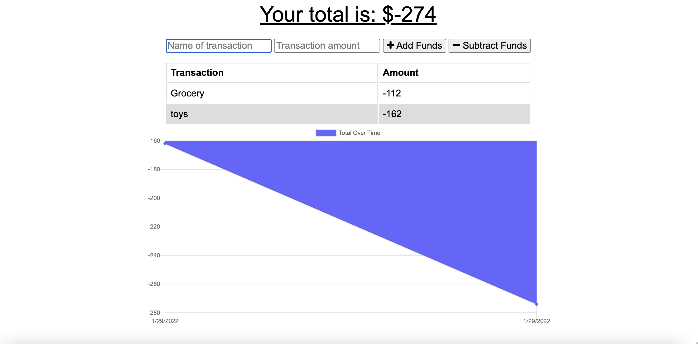

# Budget Tracker Starter Code

## Description
This application is to assist avid travelers to keep track of deposits and withdrawals without data or internet connection.

## Table of Contents
* [Installation](#installation)
* [Built With](#builtwith)
* [Usage](#usage)
* [Website](#website)
* [Credits](#credits)
* [Questions](#questions)

## Installation 
  1. copy repository
  2. download the file into your computer
  3. npm i

## Built With
* HTML
* CSS
* JavaScript
* express
* Mongoose
* MongoDB
* Compression
* Morgan
* Manifest
* Service Worker
* IndexDB

  
## Usage 
The following image demonstrates the web application's appearance and functionality:

## Website
[Repository](https://github.com/flowingcityloy/Budget-Tracker) 
[Live Site](https://budget-tracker-lydia.herokuapp.com/)

## Credits

Start code from <a href="https://github.com/coding-boot-camp/miniature-eureka">Xandromus</a> 
Lydia L
    
## Questions
  
  If you have any questions, please reach out to me at: 
  <a href="https://github.com/flowingcityloy">GitHub Link</a> 
  <a href="mailto:lydia_art@yahoo.com">Email</a> 
  Thank you!
